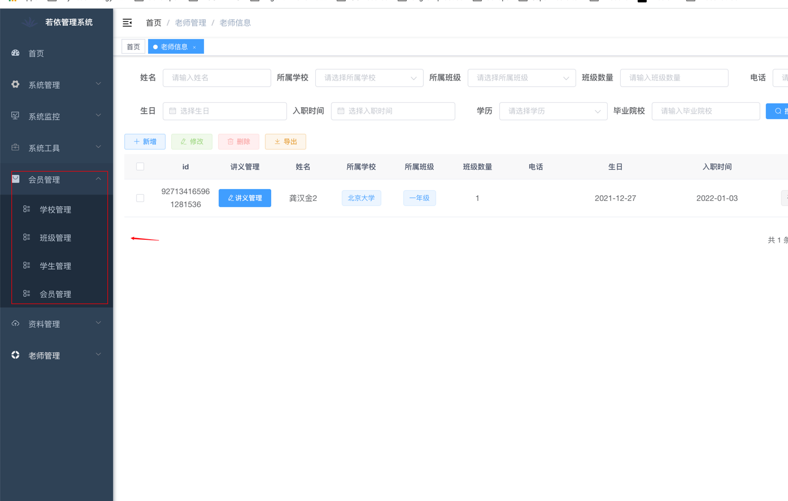
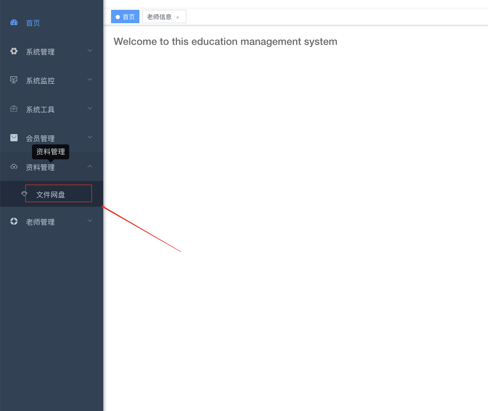
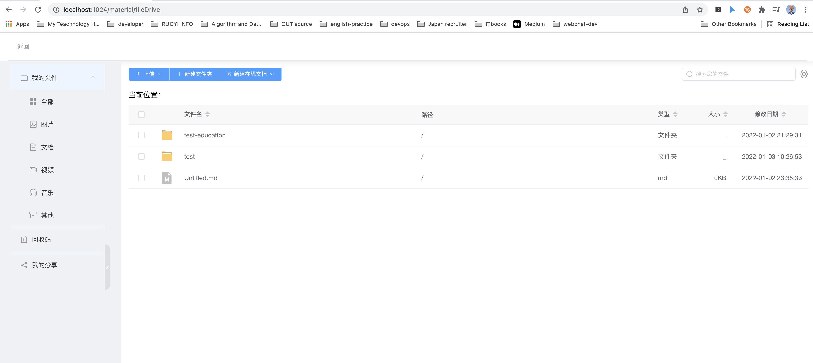
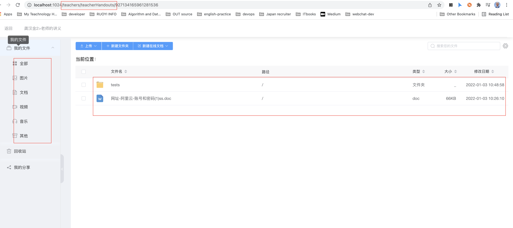

`# 平台简介

这是一个基于[若依RuoYi-Cloud微服务版本](https://gitee.com/y_project/RuoYi-Cloud)实现的教育平台.

能批量改作业,管理学校,学生,文件网盘,讲义管理

项目还在不断更新迭代中. 有还有功能没完善. 大概会在2022年1月底会上一版,包含微信小程序. 

# 安装方式

首先项目使用的是JDK17, 而不是jdk1.8注意哦.

如果用idea开发的,记得升级到2021.3以上. 因为2021.3对jdk17支持比较好.

### 第一步:

把基础后端和前端项目部署起来先.

因为本项目是基于RuoYi-Cloud的,只要把RuoYi-Cloud部署起来就成功了90%了,并且,决大部分文档只需要参考RuoYi-Cloud的就可以

[环境部署文档 | RuoYi-clould](http://doc.ruoyi.vip/ruoyi-cloud/document/hjbs.html)

```shell
http://doc.ruoyi.vip/ruoyi-cloud/document/hjbs.html
```

注意:

这里的mysql,redis密码统分别放在nacos各个不同的微服务配置文件中.要分开修改.

## 第二步:

把前面一步完成了后.

接下来作以下操作:

- 安装elasticsearch

https://www.elastic.co/elasticsearch/

- 安装minio

  https://min.io/

因为RuoYiFileApplication服务的网盘功能的搜索是基于elasticsearch的,文件管理默认使用的是minio


在项目根目录下的sql-eduction目录下有三个sql脚本

```shell
sql-eduction
|-- ry-config20220106.sql
|-- ry-clould-2022-01-05.sql

```

- ry-config20220106.sql请刷覆盖到ry-config库中
- ry-clould-2022-01-05.sql请刷覆盖到ry-cloud库中
  
  注意:

  这里的mysql,redis密码统一放在ruoyi-application-dev.yml

   另外minio的用户名和密码在ruoyi-file-dev.yml里需要修改 

- 教育平台的微服务是RuoYiEducationAdminApplication,RuoYiFileApplication启动这个两个


作完前面两大步骤.就可以正常运行本项目了.

# 功能展示截图:

* ### 学校管理,班级管理,学生管理,会员管理 

* ### 文件网盘(用于管理素材,视频,绘本,一切文件管理)
  
  
  
  

* ### 讲义管理,各个老师班级管理
  
  
  
  

## 技术栈:

* 采用前后端分离的模式，基于[若依微服务版](https://gitee.com/y_project/RuoYi-Cloud)。
* 后端采用Spring Boot、Spring Cloud & Alibaba。
* 注册中心、配置中心选型Nacos，权限认证使用Redis。
* 流量控制框架选型Sentinel，分布式事务选型Seata。

## 系统模块

```
com.ruoyi     
├── ruoyi-ui              // 前端框架 [80]
├── ruoyi-gateway         // 网关模块 [8080]
├── ruoyi-auth            // 认证中心 [9200]
├── ruoyi-api             // 接口模块
│       └── ruoyi-api-system                          // 系统接口
├── ruoyi-common          // 通用模块
│       └── ruoyi-common-core                         // 核心模块
│       └── ruoyi-common-datascope                    // 权限范围
│       └── ruoyi-common-datasource                   // 多数据源
│       └── ruoyi-common-log                          // 日志记录
│       └── ruoyi-common-redis                        // 缓存服务
│       └── ruoyi-common-security                     // 安全模块
│       └── ruoyi-common-swagger                      // 系统接口
├── ruoyi-modules         // 业务模块
│       └── ruoyi-system                              // 系统模块 [9201]
│       └── ruoyi-gen                                 // 代码生成 [9202]
│       └── ruoyi-job                                 // 定时任务 [9203]
│       └── ruoyi-file                                // 文件服务 [9300]
├── ruoyi-visual          // 图形化管理模块
│       └── ruoyi-visual-monitor                      // 监控中心 [9100]
├──pom.xml                // 公共依赖
```

## 架构图


## 内置功能

1. 用户管理：用户是系统操作者，该功能主要完成系统用户配置。
2. 部门管理：配置系统组织机构（公司、部门、小组），树结构展现支持数据权限。
3. 岗位管理：配置系统用户所属担任职务。
4. 菜单管理：配置系统菜单，操作权限，按钮权限标识等。
5. 角色管理：角色菜单权限分配、设置角色按机构进行数据范围权限划分。
6. 字典管理：对系统中经常使用的一些较为固定的数据进行维护。
7. 参数管理：对系统动态配置常用参数。
8. 通知公告：系统通知公告信息发布维护。
9. 操作日志：系统正常操作日志记录和查询；系统异常信息日志记录和查询。
10. 登录日志：系统登录日志记录查询包含登录异常。
11. 在线用户：当前系统中活跃用户状态监控。
12. 定时任务：在线（添加、修改、删除)任务调度包含执行结果日志。
13. 代码生成：前后端代码的生成（java、html、xml、sql）支持CRUD下载 。
14. 系统接口：根据业务代码自动生成相关的api接口文档。
15. 服务监控：监视当前系统CPU、内存、磁盘、堆栈等相关信息。
16. 在线构建器：拖动表单元素生成相应的HTML代码。
17. 连接池监视：监视当前系统数据库连接池状态，可进行分析SQL找出系统性能瓶颈。

## 在线体验

- admin/admin123  
- 陆陆续续收到一些打赏，为了更好的体验已用于演示服务器升级。谢谢各位小伙伴。

演示地址：http://ruoyi.vip  
文档地址：http://doc.ruoyi.vip

## 演示图

<table>
    <tr>
        <td></td>
        <td></td>
    </tr>
    <tr>
        <td></td>
        <td></td>
    </tr>
    <tr>
        <td></td>
        <td></td>
    </tr>
    <tr>
        <td></td>
        <td></td>
    </tr>     
    <tr>
        <td></td>
        <td></td>
    </tr>
    <tr>
        <td></td>
        <td></td>
    </tr>
    <tr>
        <td></td>
        <td></td>
    </tr>
    <tr>
        <td></td>
        <td></td>
    </tr>
    <tr>
        <td></td>
        <td></td>
    </tr>
</table>

## 交流

微信:live1520
